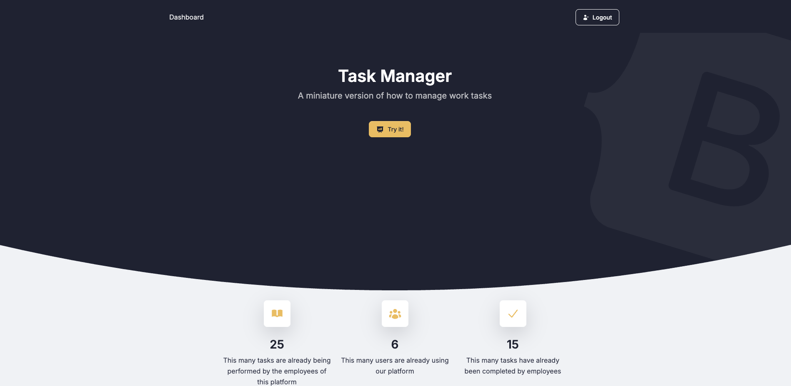

# Task Manager

Django project for managing tasks for your project

## Check it out!

[Task manager project depoloyed to Render]()


## Installation

Python3 must be already installed

```shell
git clone https://github.com/yvespy/task-manager
cd task-manager
python3 -m venv venv
source venv/bin/activate
pip install -r requirements.txt
python manage.py runserver
```

## Features

* Authentication functionality for Worker/User
* Managing worker tasks directly from website interface
* Powerful admin panel for advanced managing

## Demo
